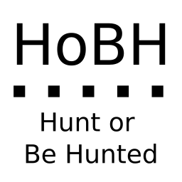

# Hunt or Be Hunted

#### A wildlife simulator

---

## Overview

This project is a simulator of wild life. There are two types of animals: **predators** and **preys**.
Each predator hunts for preys. Each prey needs resources to survive: water (from water sources), energy
(from plant sources) and breeding for continuity of population (from hideouts).

Each animal works as a separate thread. Every resource is limited, so that if the resource
is not released, the animal must wait.

## How To Use

You can create a new animal using two methods

1. Create random - choose whether you want predator or prey to be spawned
2. Create custom - adjust parameters by your own

Then you can watch how all creatures interact with the environment. If you want to see details about animals
located in a specific cell, just click on it.

You can remove an animal by clicking "X" on the top left corner. If you want to change destination of predator,
you can use one of two buttons: `Find food` or `Find water`. Then the new target of a prey will be set, and the new path
will be calculated.

---

Created by Szymon Siemieniuk (siemieniuk)